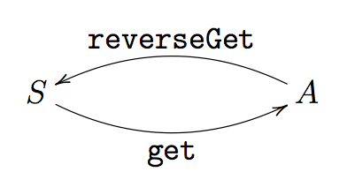
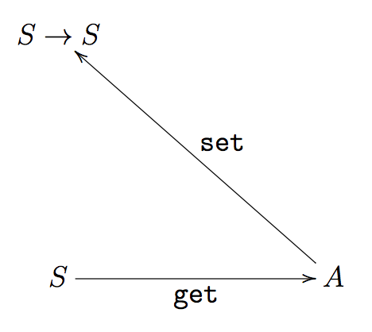
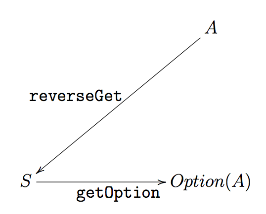
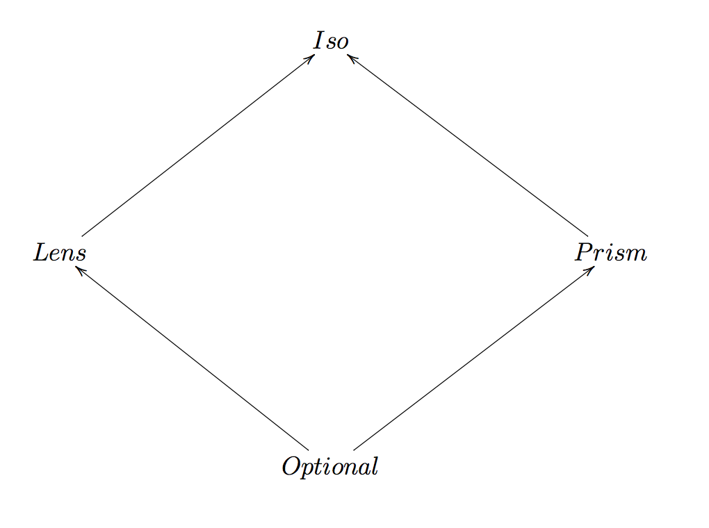

# Introduction to functional optics

---

# Self Introduction

- Giulio Canti (@GiulioCanti)
- Degree in mathematics
- Writing and teaching TypeScript and functional programming for the past 2 years

---

# Agenda

1. **Introduction**
2. Iso
3. Lens
4. Prism
5. Optional

---

# Introduction

Benefits of programming with immutable objects (\*)

- Thread safety
- No invalid state
- Better encapsulation
- Simpler to test
- More readable and maintainable code

(\*) https://hackernoon.com/5-benefits-of-immutable-objects-worth-considering-for-your-next-project-f98e7e85b6ac

---

# Introduction

**Thread safety**. Given that by definition an immutable object cannot be changed, you will not have any synchronization issues when using them.

---

# Introduction

**No invalid state**. Once you are given an immutable object and verify its state, you know it will always remain safe.

---

# Introduction

**Better encapsulation**. Since you know the object won’t change, anytime you pass this object to another method you can be positive that doing so will not alter the original state of that object in the calling code (no defensive copying).

---

# Introduction

**Simpler to test**. When your code is designed in a way that lead to less side effects, there are less confusing code paths to track down.

---

# Introduction

**More readable and maintainable code**. Any piece of code working against an immutable object does not need to be concerned with affecting other areas of your code using that object. This means there are less intermingled and moving parts in your code.

---

# Introduction

This talk assumes that our data structures are immutable. To see why we might want to consider optics, we'll look at a simple example. We'll define two interfaces

```ts
interface Address {
  city: string
  street: Street
}
interface Street {
  num: number
  name: string
}
```

---

# Introduction

Given an instance of `Address`, getting the street `name` is quite simple

```ts
const a1: Address = {
  city: 'london',
  street: {
    num: 23,
    name: 'high street'
  }
}
const name = a1.street.name
```

---

# Introduction

Setting it to a new value is less so

```ts
const a2: Address = {
  ...a1,
  street: {
    ...a1.street,
    name: 'main street'
  }
}
```

As we can see working with values deep within the data structure starts to get awkward.

---

# Functional optics

Functional optics help to manage (read, write, update) immutable data structures in a principled and composable way.

---

# Agenda

1. Introduction
2. **Iso**
3. Lens
4. Prism
5. Optional

---

# `Iso`

An **isomorphism** between two types `S` and `A` is a pair of functions

<center></center>

---

# `Iso`

Definition

```ts
class Iso<S, A> {
  constructor(
    readonly get: (s: S) => A,
    readonly reverseGet: (a: A) => S
  ) {}
}
```

---

# `Iso`

Laws

- `get . reverseGet = identity`
- `reverseGet . get = identity`

---

# `Iso`

Examples

```ts
const mTokm = new Iso<number, number>(
  m => m / 1000,
  km => km * 1000
)
const kmToMile = new Iso<number, number>(
  km => km * 0.621371,
  mile => mile / 0.621371
)
```

---

# `Iso`

Composition

```ts
class Iso<S, A> {
  ...
  compose<B>(ab: Iso<A, B>): Iso<S, B> {
    return new Iso(
      s => ab.get(this.get(s)),
      b => this.reverseGet(ab.reverseGet(b))
    )
  }
}
```

```ts
const mToMile = mTokm.compose(kmToMile)
```

---

# `Iso`

Lifting

```ts
class Iso<S, A> {
  ...
  modify(f: (a: A) => A): (s: S) => S {
    return s => this.reverseGet(f(this.get(s)))
  }
}
```

---

# Agenda

1. Introduction
2. Iso
3. **Lens**
4. Prism
5. Optional

---

# `Lens`

A lens is a first-class reference to a subpart of some data type.

<center></center>

---

# `Lens`

Definition

```ts
class Lens<S, A> {
  constructor(
    readonly get: (s: S) => A,
    readonly set: (a: A) => (s: S) => S
  ) {}
}
```

The type `S` represents the whole, `A` the subpart.

---

# `Lens`

Laws

- `get(set(a)(s)) = a`
- `set(get(s))(s) = s`
- `set(a)(set(a)(s)) = set(a)(s)`

---

# `Lens`

Let's define a lens for the type `Address` with focus on the `street` field

```ts
const address = new Lens<Address, Street>(
  address => address.street,
  street => address => ({ ...address, street })
)

address.get(a1)
// => {num: 23, name: "high street"}
address.set({ num: 23, name: 'main street' })(a1)
// => {city: "london", street: {num: 23, name: "main street"}}
```

---

# `Lens`

Now let's define a lens for the type `Street` with focus on the `name` field

```ts
const street = new Lens<Street, string>(
  street => street.name,
  name => street => ({ ...street, name })
)
```

Is there a way to get a lens for the type `Address` with focus on the inner `name` field?

---

# `Lens`

The great thing about lenses is that they **compose**

```ts
class Lens<S, A> {
  ...
  compose<B>(ab: Lens<A, B>): Lens<S, B> {
    return new Lens(
      s => ab.get(this.get(s)),
      b => s => this.set(ab.set(b)(this.get(s)))(s)
    )
  }
}
```

---

# `Lens`

Now handling the inner `name` is trivial

```ts
const name = address.compose(street)

name.get(a1)
// => "high street"
name.set('main street')(a1)
// => {city: "london", street: {num: 23, name: "main street"}}
```

---

# `Lens`

Lifting

```ts
class Lens<S, A> {
  ...
  modify(f: (a: A) => A): (s: S) => S {
    return s => this.set(f(this.get(s)))(s)
  }
}
```

---

# `Lens`

Let's say we need to set the first character of the address street name in upper case

```ts
const capitalize = (s: string): string =>
  s.substring(0, 1).toUpperCase() + s.substring(1)

const capitalizeName = name.modify(capitalize)

capitalizeName(a1)
// => {city: "london", street: {num: 23, name: "High street"}}
```

---

In the previous example, we used `capitalize` to upper case the first letter of a string.

It works but it would be clearer if we could use `Lens` to zoom into the first character of a string.

However, we cannot write such a `Lens` because a `Lens` defines how to focus from an object `S` into a **mandatory** object `A`.

In our case, the first character of a string is **optional** as a string might be empty.

---

# Agenda

1. Introduction
2. Iso
3. Lens
4. **Prism**
5. Optional

---

# `Prism`

`Lens`es manage product types.

`Prism`s manage sum types.

---

# `Prism`

```ts
type Action =
  | {
      type: 'ADD_TODO'
      text: string
    }
  | {
      type: 'UPDATE_TODO'
      id: number
      text: string
      completed: boolean
    }
  | {
      type: 'DELETE_TODO'
      id: number
    }
```

---

# `Prism`

Let's focus on `ADD_TODO`.

Given a `string` we can build an `Action`

```ts
const reverseGet = (text: string): Action => ({
  type: 'ADD_TODO',
  text
})
```

What about the other direction?

We need a type that represents the effect of a computation that can fail.

---

# `Option`

```ts
// type
type Option<A> =
  | { type: 'None' }
  | {
      type: 'Some'
      value: A
    }

// constructors
const none: Option<never> = { type: 'None' }

const some = <A>(a: A): Option<A> => ({
  type: 'Some',
  value: a
})
```

---

# `Option`

```ts
// pattern matching
const match = <A, R>(
  fa: Option<A>,
  whenNone: R,
  whenSome: (a: A) => R
): R => {
  return fa.type === 'None' ? whenNone : whenSome(fa.value)
}

// sequencing
const chain = <A, B>(
  fa: Option<A>,
  f: (a: A) => Option<B>
): Option<B> => match(fa, none, f)
```

---

# `Prism`

```ts
const getOption = (action: Action): Option<string> =>
  action.type === 'ADD_TODO' ? some(action.text) : none
```

<center></center>

---

# `Prism`

Definition

```ts
class Prism<S, A> {
  constructor(
    readonly getOption: (s: S) => Option<A>,
    readonly reverseGet: (a: A) => S
  ) {}
}
```

---

# `Prism`

Laws

- `match(getOption(s), s, reverseGet) = s`
- `getOption(reverseGet(a)) = some(a)`

---

# `Prism`

```ts
const ADD_TODO = new Prism<Action, string>(
  s => (s.type === 'ADD_TODO' ? some(s.text) : none),
  a => ({
    type: 'ADD_TODO',
    text
  })
)
```

---

# `Prism`

Composition

```ts
class Prism<S, A> {
  ...
  compose<B>(ab: Prism<A, B>): Prism<S, B> {
    return new Prism(
      s => chain(this.getOption(s), a => ab.getOption(a))),
      b => this.reverseGet(ab.reverseGet(b))
    )
  }
}
```

---

# `Prism`

Lifting

```ts
class Prism<S, A> {
  ...
  modify(f: (a: A) => A): (s: S) => S {
    return s => {
      const oa = this.getOption(s)
      return oa.type === 'None'
        ? s
        : this.reverseGet(f(oa.value))
    }
  }
}
```

---

# `Prism`

Decoders + Encoders are `Prism`s

```ts
const numberFromString = new Prism<string, number>(
  s => {
    const n = +s
    return isNaN(n) ? none : some(n)
  },
  a => String(a)
)
```

---

# `Prism`

Refinements are `Prism`s

```ts
const numberFromString = new Prism<string, number>(
  s => {
    const n = +s
    return isNaN(n) ? none : some(n)
  },
  a => String(a)
)

const integer = new Prism<number, number>(
  s => (s % 1 === 0 ? some(s) : none),
  a => a
)
```

---

# `Prism`

And we can compose them

```ts
const numberFromString = new Prism<string, number>(
  s => {
    const n = +s
    return isNaN(n) ? none : some(n)
  },
  a => String(a)
)

const integer = new Prism<number, number>(
  s => (s % 1 === 0 ? some(s) : none),
  a => a
)

const integerFromString = numberFromString.compose(integer)
```

---

# Agenda

1. Introduction
2. Iso
3. Lens
4. Prism
5. **Optional**

---

# `Optional`

`Optional`s combine `Lens`es with `Prism`s.

```ts
class Optional<S, A> {
  constructor(
    readonly getOption: (s: S) => Option<A>,
    readonly set: (a: A) => (s: S) => S
  ) {}
}
```

---

# `Optional`

Example

```ts
const firstLetter = new Optional<string, string>(
  s => (s.length > 0 ? some(s[0]) : none),
  a => s => (s.length > 0 ? a + s.substring(1) : s)
)

console.log(firstLetter.getOption('hi!')) // => some('h')
console.log(firstLetter.getOption('')) // => none
console.log(firstLetter.set('H')('hi!')) // => 'Hi!'
console.log(firstLetter.set('H')('')) // => ''
```

---

# `Optional`

Composition

```ts
class Optional<S, A> {
  ...
  compose<B>(ab: Optional<A, B>): Optional<S, B> {
    return new Optional<S, B>(
      s => chain(this.getOption(s), a => ab.getOption(a)),
      b => s => this.modify(a => ab.set(b)(a))(s)
    )
  }
}
```

---

# `Optional`

Lifting

```ts
class Optional<S, A> {
  ...
  modify(f: (a: A) => A): (s: S) => S {
    return s => {
      const oa = his.getOption(s)
      return oa.type === 'None' ? s : this.set(f(a))(s)
    }
  }
}
```

---

# Diagram

<center></center>

---

# `Iso` -> `Lens`

```ts
class Iso<S, A> {
  ...
  asLens(): Lens<S, A> {
    return new Lens(this.get, a => _ => this.reverseGet(a))
  }
}
```

---

# `Lens` -> `Optional`

```ts
class Lens<S, A> {
  ...
  asOptional(): Optional<S, A> {
    return new Optional(s => some(this.get(s)), this.set)
  }
}
```

---

Back to our problem

```ts
//  address: Lens<Address, Stree>
//  street: Lens<Street, string>
//  firstLetter: Optional<string, string>

const nameFirstLetter: Optional<Address, string> = address
  .compose(street)
  .asOptional()
  .compose(firstLetter)

const toUpperCase = (s: string): string => s.toUpperCase()

console.log(nameFirstLetter.modify(toUpperCase)(a1))
// { city: 'london', street: { num: 23, name: 'High street' } }
```

---

# Thanks

- Slides https://github.com/gcanti/talks/tree/master/optics

### Functional programming

- Free book (italian) https://github.com/gcanti/functional-programming
- TypeScript library https://github.com/gcanti/monocle-ts
